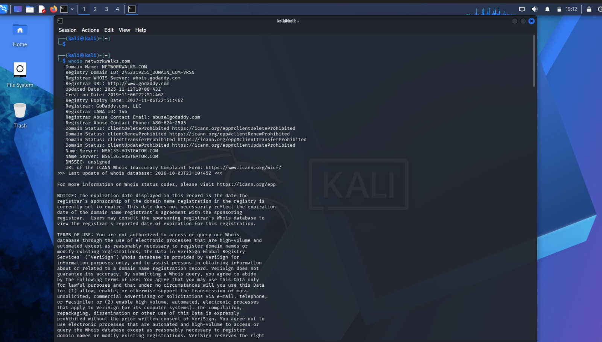
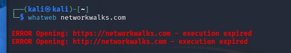
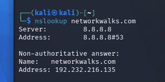
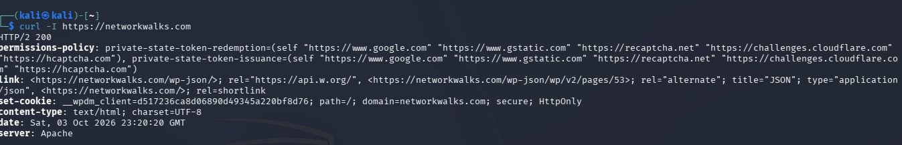
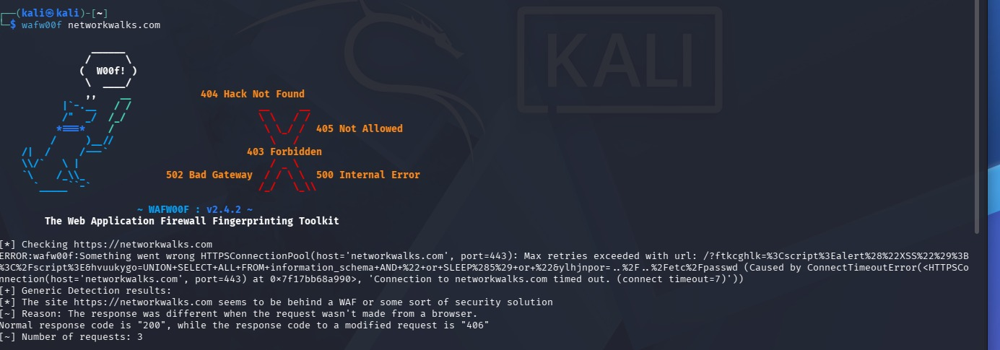
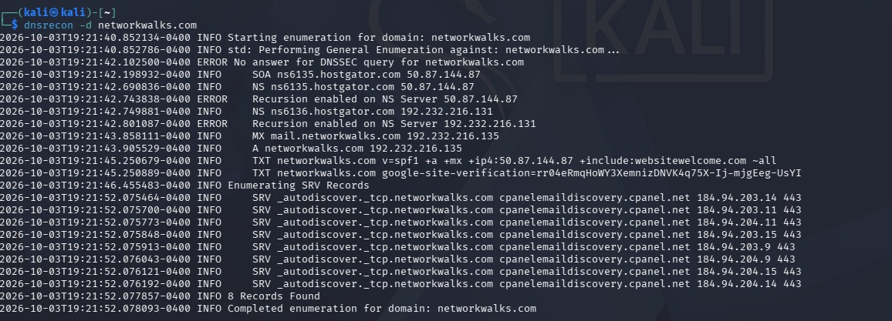
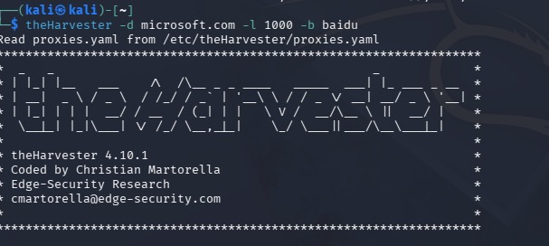
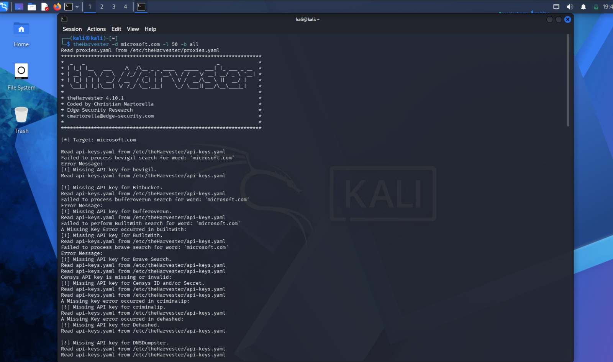

# Week 2: Footprinting & Reconnaissance

Networkwalks Cybersecurity & Ethical Hacking Internship, Batch B083
**Author:** [Your Name]

[2-3 sentences in your own words: what this week was about and what you set out to do.]

Modules covered:

- **PM1:** footprinting `networkwalks.com` with whois, whatweb, nslookup, curl, wafw00f and dnsrecon
- **PM4:** gathering emails and subdomains for `microsoft.com` with theHarvester

**Scope note:** Everything was run against the course-provided target (`networkwalks.com`) or public OSINT sources only. Nothing here exploits anything.

---

## Why this matters

[Your own explanation of why footprinting is useful for attackers and defenders.]

---

## PM1: Footprinting networkwalks.com

### Task 1: whois

```
whois networkwalks.com
```

**What I found:** [registrar, creation/expiry dates, name servers]



### Task 2: whatweb

```
whatweb networkwalks.com
```

**What I found:** [web server, CMS, plugins, versions]



### Task 3: nslookup

```
nslookup networkwalks.com
```

**What I found:** [IP address, DNS server used, authoritative or not]



### Task 4: curl -I

```
curl -I https://networkwalks.com
```

**What I found:** [status code, server header, interesting headers]



### Task 5: wafw00f

```
wafw00f networkwalks.com
```

**What I found:** [WAF detected or not, which one]



### Task 6: dnsrecon

```
dnsrecon -d networkwalks.com
```

**What I found:** [record types: SOA, NS, A, MX, TXT, SRV]



---

## PM4: theHarvester (microsoft.com)

### Task 1: Baidu only, limit 1000

```
theHarvester -d microsoft.com -l 1000 -b baidu
```

**What I found:** [emails, hosts, subdomains returned]



### Task 2: all sources, limit 50

```
theHarvester -d microsoft.com -l 50 -b all
```

**What I found:** [what worked, what failed and why]



---

## Problems I ran into

[Only include real problems from YOUR run: the error message, what you thought it meant, and what it actually was or how you fixed it. Delete this section if nothing went wrong.]

---

## What I took away from this week

- [Your point 1]
- [Your point 2]
- [Your point 3]

---

## Tools used

- whois, whatweb, nslookup, curl, wafw00f, dnsrecon
- theHarvester [version: run `theHarvester -h` to check]

---

## Disclaimer

For learning only. Done as part of the Networkwalks course, using course-provided targets and public information. Do not run these tools against systems you do not own or lack written permission to test.

---

**[Your Name]**, Batch B083, Networkwalks Cybersecurity Program
